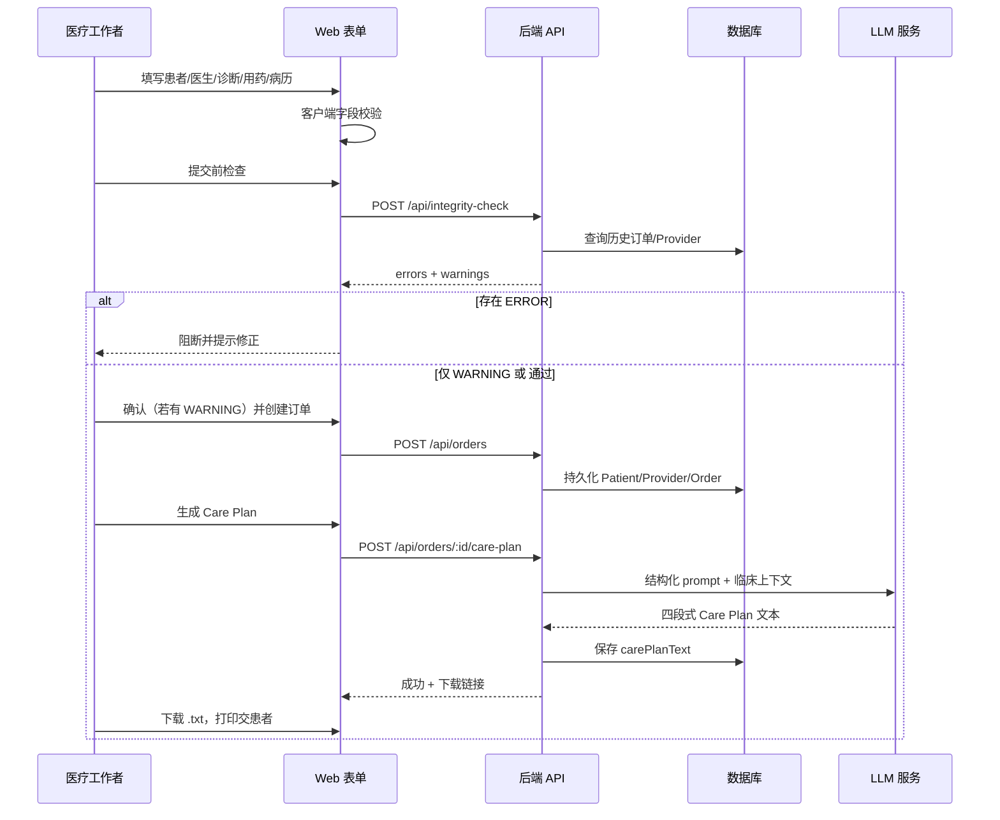

# Care Plan 自动生成系统 — Design Document

| 字段 | 内容 |
| --- | --- |
| **版本** | 1.0 |
| **状态** | Draft |
| **受众** | 工程、产品、QA |
| **客户场景** | Specialty pharmacy（CVS 医疗工作者内部使用） |

---

## 1. 背景与问题

### 1.1 业务背景

专科药房需为每位患者、每种药物编制 **Care Plan**，以满足合规要求，并支撑 **Medicare** 与 **药企（pharma）** 报销与报告。当前由药师人工阅读病历后撰写，单患者耗时约 **20–40 分钟**。人手不足导致严重积压。

### 1.2 要解决的核心问题

在**不破坏现有工作流**的前提下，让医疗助理通过 Web 表单录入结构化临床信息，经校验与完整性检查后，由 **LLM** 自动生成可下载的 Care Plan 文本，并支持药企报告导出。

### 1.3 成功标准

| 指标 | 目标 |
| --- | --- |
| 录入与生成 | 医疗工作者可独立完成「录入 → 校验 → 生成 → 下载」 |
| 合规输出 | Care Plan 固定包含四大区块（见 §3） |
| 数据质量 | 全字段校验；完整性规则在提交前/时强制执行 |
| 重复与冲突 | 按规则区分 **ERROR（阻断）** 与 **WARNING（可确认继续）** |
| 可运维性 | 模块化代码、关键逻辑有自动化测试、开箱可跑通 E2E |

---

## 2. 用户与范围

### 2.1 用户

| 角色 | 是否使用系统 | 说明 |
| --- | --- | --- |
| **CVS 医疗工作者**（医疗助理 / 药师） | ✅ | 开药流程中录入信息、生成并打印 Care Plan |
| **患者** | ❌ | 不接触本系统；仅接收打印件 |

### 2.2 范围（In Scope）

- Web 表单录入与字段级校验
- 患者 / 订单 / 转诊医生（Provider）重复与一致性检测
- LLM 生成 Care Plan（`.txt` 下载）
- Pharma 报告导出
- Provider 在系统中仅维护一份权威记录（按 NPI 去重）

### 2.3 非目标（Out of Scope — 初版）

- 患者自助门户、EHR 深度双向集成（可作为后续迭代）
- 多语言 Care Plan（除非客户明确要求）
- 电子签名 / 正式医疗文书归档（初版以文本交付为主）

---

## 3. 核心概念

### 3.1 订单（Order）

> **一个 Care Plan 对应一个订单；一个订单 = 一名患者 + 一种药物。**

同一患者多种 specialty 药物应创建**多个订单**，各自生成独立 Care Plan。

### 3.2 Care Plan 结构（输出契约）

生成结果必须为结构化文本，**必须包含**以下四个部分（顺序建议固定，便于打印与药企解析）：

1. **Problem list / Drug therapy problems (DTPs)**
2. **Goals (SMART)**
3. **Pharmacist interventions / plan**
4. **Monitoring plan & lab schedule**

LLM 提示词与后处理需约束章节标题与内容完整性；缺任一区块视为生成失败，需安全重试或明确错误提示。

### 3.3 Provider

- **NPI** 为转诊医生的唯一标识（10 位数字）。
- 同一 NPI 在系统中只对应**一个** Provider 实体；姓名变更应更新同一记录，而非新建。
- **NPI 相同但姓名不同** → **ERROR**，必须修正后再提交。

### 3.4 患者标识

- **MRN**：6 位唯一数字（业务侧患者 ID）。
- 辅助字段：**姓名**、**DOB**（用于跨 MRN 的疑似同人检测）。

---

## 4. 功能需求

| 功能 | 优先级 | 说明 |
| --- | --- | --- |
| 患者 / 订单重复检测 | P0 | 不打乱工作流；区分阻断与警告 |
| Care Plan 生成 | P0 | 核心价值；LLM + 固定四段结构 |
| Provider 重复 / 一致性 | P0 | 影响 pharma 报告准确性 |
| Care Plan 下载 | P0 | 供上传至客户既有系统 |
| Pharma 报告导出 | P0 | 快速批量/筛选导出 |
| 表单校验 | P0 | 每个输入均有规则 |
| 完整性规则 | P0 | 服务端始终执行，不可仅靠前端 |

---

## 5. 输入数据模型

### 5.1 表单字段

| 字段 | 类型 | 校验要点 |
| --- | --- | --- |
| Patient First Name | string | 非空；合理长度 |
| Patient Last Name | string | 非空 |
| Patient DOB | date | 合法日期；用于完整性警告 |
| Referring Provider Name | string | 非空 |
| Referring Provider NPI | string | 恰好 10 位数字 |
| Patient MRN | string | 恰好 6 位数字；系统内唯一性由业务规则约束 |
| Patient Primary Diagnosis | ICD-10 | 格式校验（如 `G70.00`） |
| Medication Name | string | 非空；与订单 1:1 |
| Additional Diagnosis | ICD-10[] | 每项格式校验 |
| Medication History | string[] | 列表项非空 |
| Patient Records | string **或** PDF | 文本非空或 PDF 类型/大小限制 |

### 5.2 患者记录（Patient Records）

- 支持**粘贴文本**或**上传 PDF**。
- PDF：限制 MIME、大小上限；提取文本供 LLM 使用（实现可选用 pdf 解析库）。
- 记录内容应作为 LLM 的主要临床上下文，与结构化字段一并传入。

---

## 6. 完整性规则与重复检测

规则在 **提交订单前**（`integrity-check`）与 **创建订单时**（服务端）均须执行。前端可预检，**以后端为准**。

### 6.1 规则表

| 场景 | 级别 | 用户操作 |
| --- | --- | --- |
| 同一患者 + 同一药物 + **同一天** | ❌ **ERROR** | 必须阻止提交 |
| 同一患者 + 同一药物 + **不同天** | ⚠️ **WARNING** | 展示原因；用户确认后可继续（续方场景） |
| MRN 相同 + 姓名或 DOB 不同 | ⚠️ **WARNING** | 可确认继续（可能录入错误） |
| 姓名 + DOB 相同 + MRN 不同 | ⚠️ **WARNING** | 可确认继续（可能同一人） |
| NPI 相同 + Provider 姓名不同 | ❌ **ERROR** | 必须修正姓名或 NPI |

### 6.2 「同一天」定义

- 以**订单创建日期**（服务器时区，需在产品中明确，建议药房运营时区）的日历日为准。
- 匹配维度：`patientId`（或 MRN）+ `medicationName` + `orderDate`（日粒度）。

### 6.3 WARNING 确认流

```
用户填写表单 → 完整性检查 API
  → 仅 WARNING：UI 展示列表 +「仍要提交」
  → 含 ERROR：禁用提交，逐项提示修正
用户确认 WARNING → 创建订单（请求携带 acknowledgeWarnings: true）
```

服务端须记录用户已确认 WARNING（审计字段：`warningsAcknowledgedAt` / `acknowledgedWarningCodes`）。

---

## 7. 用户流程

### 7.1 主流程（Happy Path）



### 7.2 Pharma 导出流程

- 医疗工作者或运营角色在 UI 选择日期范围 / 筛选条件。
- 调用 `GET` 或 `POST /api/export/pharma`，返回 CSV（或客户指定格式），字段至少包含：订单 ID、MRN、患者姓名、药物、Provider NPI、创建日、Care Plan 是否已生成等（具体列与药企模板对齐）。

---

## 8. 系统架构（建议）

### 8.1 逻辑分层

```
┌─────────────────────────────────────────┐
│  Presentation: Next.js 页面 + 表单组件   │
├─────────────────────────────────────────┤
│  API Routes: orders, integrity-check,    │
│              care-plan, export/pharma    │
├─────────────────────────────────────────┤
│  Domain: validation, integrity rules,    │
│          care plan prompt & parser       │
├─────────────────────────────────────────┤
│  Infrastructure: Prisma + SQLite/Postgres│
│                  OpenAI (or compatible)   │
└─────────────────────────────────────────┘
```

### 8.2 模块职责

| 模块 | 职责 |
| --- | --- |
| `lib/validation` | Zod（或同等）schema：字段格式、ICD-10、NPI、MRN |
| `lib/integrity` | 重复检测纯函数；便于单测 |
| `lib/llm` | Prompt 构建、调用、四段结构校验 |
| `lib/db` | Prisma 仓储：Patient、Provider、Order、CarePlan |
| `app/api/*` | 薄控制器：解析请求、调用 domain、统一错误格式 |

### 8.3 技术栈（与生产就绪要求对齐）

| 层 | 选型 |
| --- | --- |
| 前端 | Next.js App Router、React 表单 |
| API | Next.js Route Handlers |
| DB | Prisma + SQLite（开发）/ PostgreSQL（生产可选） |
| LLM | OpenAI API（环境变量 `OPENAI_API_KEY`） |
| 测试 | Vitest（单元）+ 可选 Playwright（E2E） |

---

## 9. 数据模型（逻辑 ER）

```mermaid
erDiagram
  PROVIDER ||--o{ ORDER : refers
  PATIENT ||--o{ ORDER : has
  ORDER ||--o| CARE_PLAN : generates

  PROVIDER {
    string id PK
    string npi UK "10 digits"
    string name
  }

  PATIENT {
    string id PK
    string mrn UK "6 digits"
    string firstName
    string lastName
    date dob
  }

  ORDER {
    string id PK
    string patientId FK
    string providerId FK
    string medicationName
    string primaryDiagnosis
    string additionalDiagnoses "JSON"
    string medicationHistory "JSON"
    string patientRecordsText
    date orderDate
    datetime warningsAcknowledgedAt
  }

  CARE_PLAN {
    string id PK
    string orderId FK UK
    text content
    datetime generatedAt
  }
```

**说明：**

- `ORDER` 上可对 `(patientId, medicationName, orderDate)` 建查询索引以支撑同日重复 ERROR。
- Provider 以 `npi` 唯一；创建订单时 upsert Provider。
- Patient 以 `mrn` 为主键业务标识；姓名/DOB 更新策略：新订单带入最新值或显式更新（需在实现中统一一种策略并写测试）。

---

## 10. API 设计（概要）

| 方法 | 路径 | 用途 |
| --- | --- | --- |
| `POST` | `/api/integrity-check` | 仅校验 + 完整性检查，不写库 |
| `POST` | `/api/orders` | 创建订单；body 含表单字段 + 可选 `acknowledgeWarnings` |
| `POST` | `/api/orders/:id/care-plan` | 触发 LLM 生成并持久化 |
| `GET` | `/api/orders/:id/care-plan` | 下载或获取已生成文本 |
| `GET` / `POST` | `/api/export/pharma` | 药企报告导出 |

### 10.1 统一错误响应

```json
{
  "error": "VALIDATION_FAILED",
  "message": "Human-readable summary",
  "details": [
    { "field": "npi", "code": "INVALID_NPI", "message": "..." }
  ],
  "integrity": {
    "errors": [{ "code": "DUPLICATE_ORDER_SAME_DAY", "message": "..." }],
    "warnings": [{ "code": "DUPLICATE_ORDER_DIFF_DAY", "message": "..." }]
  }
}
```

原则：**错误安全、清晰、可定位**；不向用户暴露堆栈或密钥。

---

## 11. LLM 生成设计

### 11.1 输入组装

Prompt 应包含：

- 结构化字段：姓名、MRN、诊断、药物、用药史列表
- 非结构化：`patientRecords` 全文（或 PDF 提取文本）
- **输出格式指令**：必须生成四个章节，参考 §3.2 与 §12 示例

### 11.2 输出校验

生成后服务端检查：

- 是否包含四个必需章节标题（或等价标记）
- 长度下限（避免空泛回复）

未通过 → 返回 `CARE_PLAN_GENERATION_FAILED`，可重试；**不**将不完整内容标为成功。

### 11.3 安全与合规

- 不在日志中记录完整 PHI；生产环境日志脱敏。
- API Key 仅服务端；禁止暴露给浏览器。

---

## 12. 示例：输入与输出

### 12.1 输入示例（患者记录摘录）

```
Name: A.B. (Fictional)
MRN: 00012345
DOB: 1979-06-08
Medication: IVIG
Primary diagnosis: Generalized myasthenia gravis ...
Secondary diagnoses: Hypertension, GERD
Home meds: Pyridostigmine, Prednisone, ...
Recent history: Progressive proximal muscle weakness ...
```

### 12.2 输出示例（Care Plan 结构）

```
Problem list / Drug therapy problems (DTPs)
- Need for rapid immunomodulation ...
- Risk of infusion-related reactions
...

Goals (SMART)
- Primary: Achieve clinically meaningful improvement ...
...

Pharmacist interventions / plan
- Dosing & Administration
- Premedication
...

Monitoring plan & lab schedule
- Before first infusion: CBC, BMP, baseline vitals
...
```

---

## 13. 前端 UX 要点

| 区域 | 要求 |
| --- | --- |
| 表单 | 分块：患者 / 医生 / 诊断与用药 / 病历；实时字段错误 |
| 完整性结果 | ERROR 红色阻断；WARNING 黄色列表 + 确认勾选 |
| 生成 | Loading 状态；失败可重试 |
| 下载 | 一键下载 `{MRN}_{medication}_{date}.txt` |
| 导出 | Pharma 导出独立入口，不阻塞单笔 Care Plan 流程 |

---

## 14. 生产就绪要求（NFR）

| 类别 | 要求 |
| --- | --- |
| **校验** | 每个输入均有 schema；API 层拒绝非法 body |
| **完整性** | 规则在服务端强制执行；WARNING 须显式确认才落库 |
| **错误处理** | 统一错误码；LLM/DB 失败不导致脏数据（事务或状态机） |
| **可维护性** | `lib/` 下纯函数 + 薄路由；目录按领域划分 |
| **测试** | integrity 规则、validation、Care Plan 章节检测必须有单测；关键 API 有集成测试 |
| **可运行性** | README：`npm install` → migrate → seed（可选）→ `npm run dev`；提供 `.env.example` |
| **性能** | 初版：单订单生成 < 60s（依赖 LLM）；表单提交 < 500ms（不含 LLM） |

---

## 15. 测试策略

| 层级 | 覆盖重点 |
| --- | --- |
| 单元 | ICD-10/NPI/MRN 校验；6 条完整性规则边界（同日/异日、MRN/姓名/DOB 组合） |
| 集成 | `POST /api/orders` 在 ERROR 时 4xx；WARNING 无 acknowledge 时 4xx |
| 合同 | Mock LLM 返回缺章节 → 生成失败 |
| E2E（可选） | 填表 → 检查 → 创建 → 生成 → 下载文件存在且含四段标题 |

---

## 16. 部署与配置

| 变量 | 说明 |
| --- | --- |
| `DATABASE_URL` | Prisma 连接串 |
| `OPENAI_API_KEY` | LLM |
| `OPENAI_MODEL` | 如 `gpt-4o-mini`（可配置） |

初版可部署于内网或 VPC；无公网患者访问。

---

## 17. 风险与开放问题

| 项 | 说明 | 建议 |
| --- | --- | --- |
| LLM 幻觉 | 临床建议可能不准确 | 文案标注「需药师审核」；未来可加人工批准状态 |
| ICD-10 校验深度 | 简单 regex vs 官方码表 | 初版 regex；后续接码表 API |
| 时区与「同一天」 | 跨日边界订单 | 文档化并单测 |
| PDF 解析质量 | 扫描件 OCR 差 | 允许纯文本粘贴为主路径 |
| Provider 改名 | 仅更新姓名 vs 历史订单 | 历史订单快照 providerNameAtOrderTime |

---

## 18. 里程碑建议

| 阶段 | 交付物 |
| --- | --- |
| M1 | 数据模型 + 表单校验 + integrity-check API |
| M2 | 创建订单 + WARNING 确认 + Provider upsert |
| M3 | LLM Care Plan 生成 + 下载 |
| M4 | Pharma 导出 + 测试覆盖 + README 开箱运行 |

---

## 19. 附录：需求溯源

| 来源 | 映射 |
| --- | --- |
| 客户原始需求 | §1、§5、§11、§14 |
| CVS 用户与打印流程 | §2 |
| 一订单一药物、四段 Care Plan | §3 |
| 重复检测规则表 | §6 |
| 功能优先级表 | §4 |
| 示例输入/输出 | §12 |

---

*文档结束。实现变更时请同步更新本 design doc 的版本号与变更说明。*
